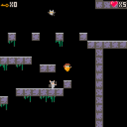

# Prison game (PICO-8 game)

  
🇫🇷

Développé dans le cadre d'un travail de groupe sur 10 jours, ce jeu est une prise en main de l'outil Pico 8 qui permet de créer des jeux vidéos rétros.

Le personnage est un prisonnier qui cherche à s'enfuir, évitant les différents pièges de cette prison ainsi que les gardes.

Le jeu est jouable à l'adresse suivante : https://atsteamacc-prisongame.netlify.app/
Il est aussi possible d'y jouer sur mobile via le navigateur.

Crédit musique : Robby Duguay.
Développeurs : Constant Guilbert, Arthur Guisne et Céline Barbe.

 

  
🇬🇧

Developped as a group project in 10 days during our second week at Ada Tech School, this game is the result of our getting familiar with PICO-8, a tool for easily creating pixel-art video games with a (neo)-retro feel.

Our hero is a prisoner trying to make an escape, avoiding various traps and guards.

You can play the game here : https://atsteamacc-prisongame.netlify.app/

Music credits : Robby Duguay
Developed by: Céline Barbe, Constant Guilbert, Arthur Guisne

